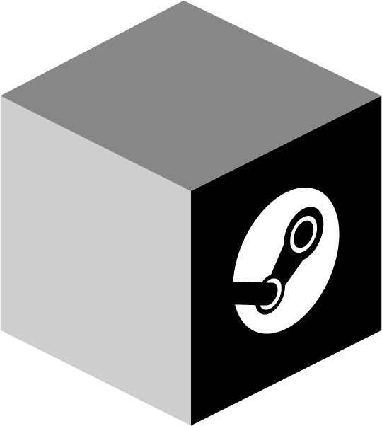
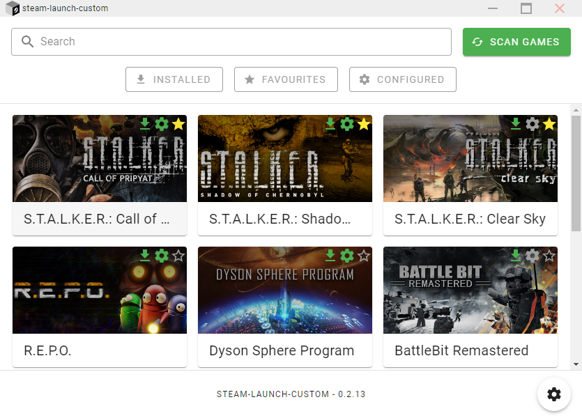
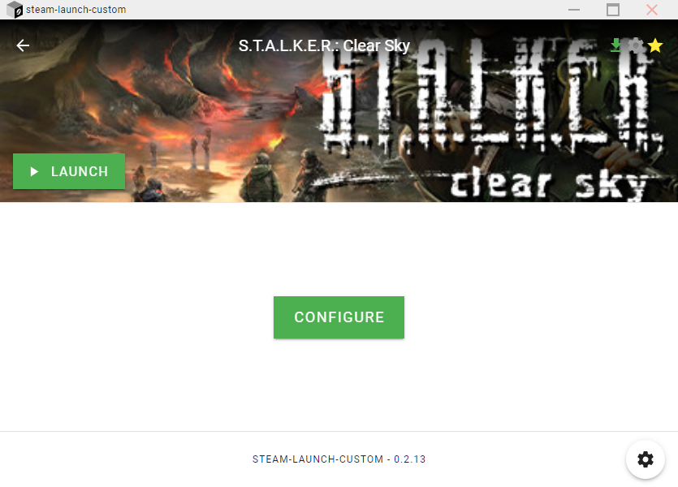
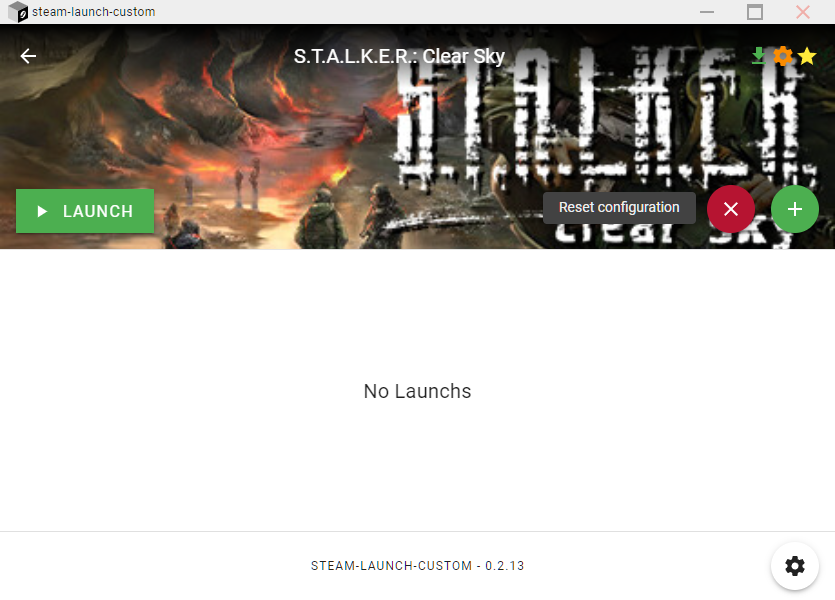
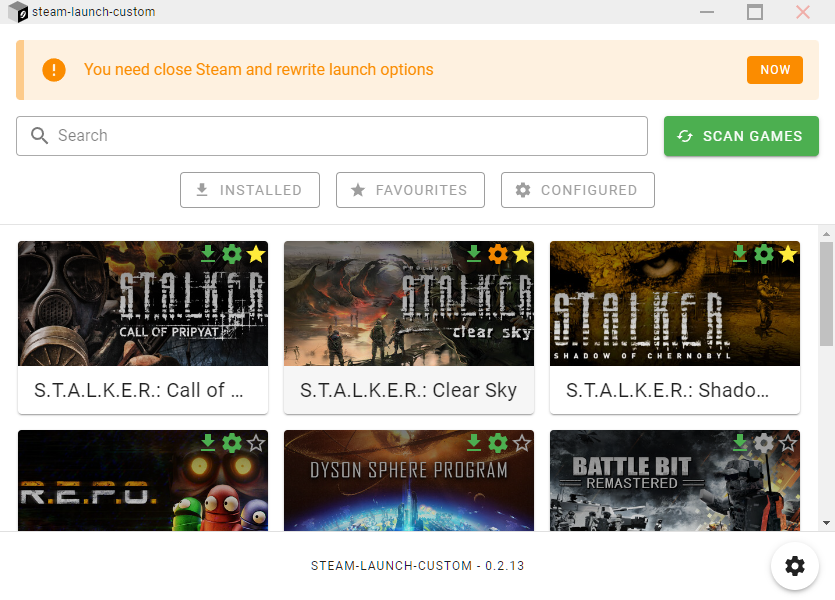
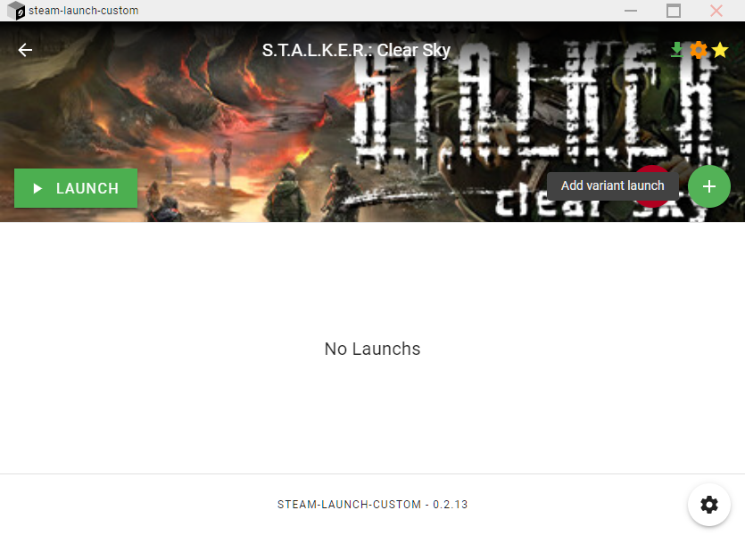
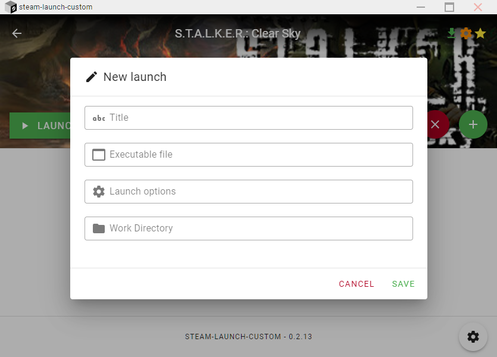
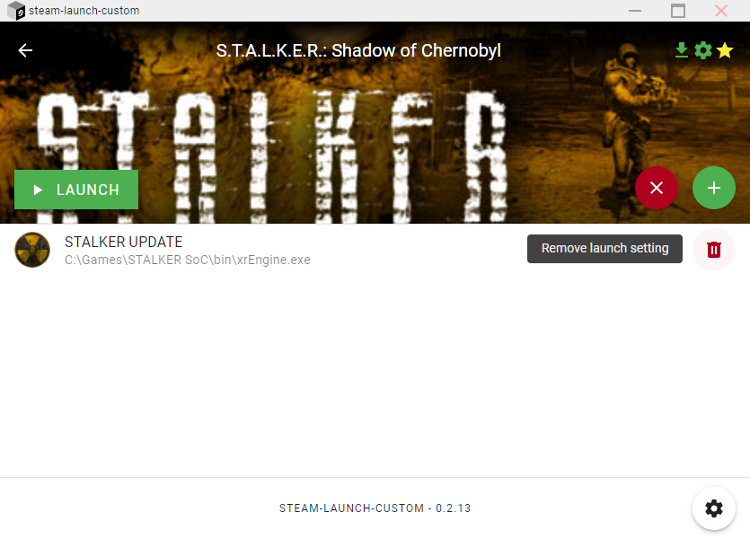
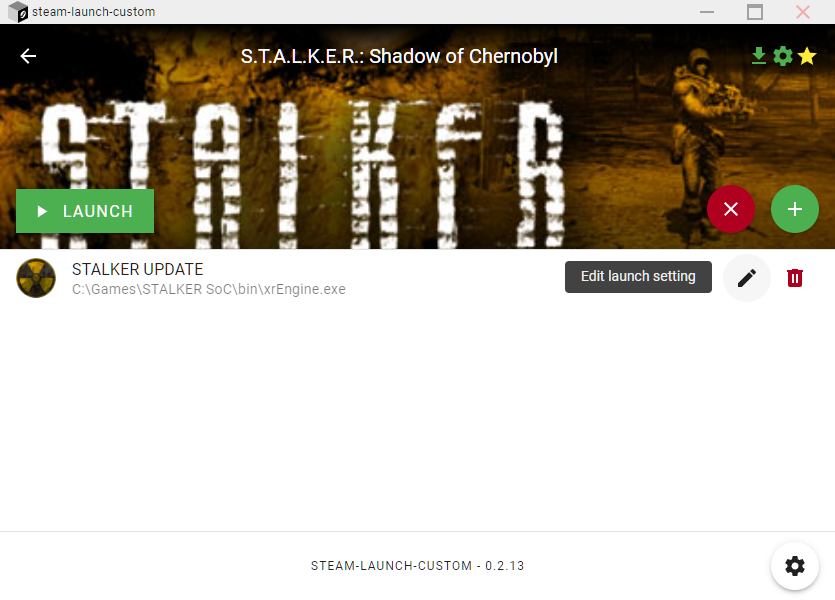
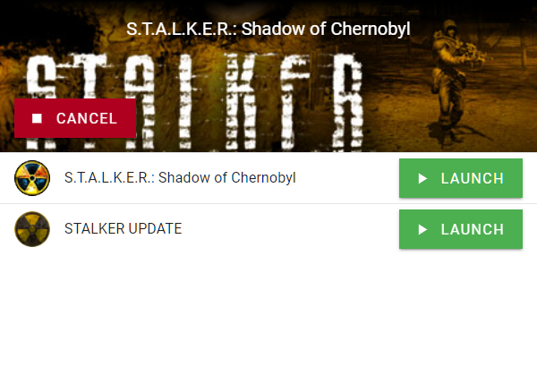

  
   
  [ <a href="./README.md">EN</a> | RU ]

# Steam-Launcher-Custom

Добавьте собственные параметры запуска для своих игр в Steam.

## Использование

1. Скачайте [последний релиз](https://github.com/80LK/steam-launch-custom/releases/latest)
2. Откройте приложение и дождитесь сканирования игр
3. После сканирования вы увидите список всех установленных игр.
 

### Конфигурация
Конфигурация изменяет файлы Steam, чтобы при запуске **steam-launch-custom** перехватывался запуск игры и открывалось окно с параметрами запуска.

1. Откройте приложение и выберите игру
2. В открывшемся окне нажмите кнопку **"НАСТРОИТЬ"**

3. Чтобы сбросить настройки, нажмите на круглую красную кнопку с крестиком.

4. Чтобы изменить статус конфигурации, необходимо перезаписать файлы Steam и перезапустить его. Для этого вернитесь на страницу игр с помощью стрелки влево. Вы увидите уведомление «Вам нужно закрыть Steam и перезаписать параметры запуска». Нажмите кнопку **"СЕЙЧАС"**

### Добавить варианты запусков
1. Откройте приложение и выберите игру
2. Чтобы добавить параметр запуска, необходимо [настроить](#Configuration) игру.
3. Нажмите на круглую зеленую кнопку со знаком "плюс", чтобы добавить новый вариант запуска.

4. В открывшемся окне укажите название варианта, исполняемый файл, параметры запуска и, при необходимости, рабочий каталог. Нажмите кнопку "СОХРАНИТЬ"

5. Чтобы удалить вариант запуска, нажмите на значок корзины рядом с нужным вариантом.

6. Чтобы изменить параметр запуска, нажмите на значок карандаша рядом с нужным параметром.

### Launching games
1. After [configuring](#Configuration) and [adding launch](#Add-launchs), you can launch the game in several ways.
    - Launch the game using Steam
    - Launch the game using **steam-launch-custom** select the game and click on the "LAUNCH" button. The game will still be launched via Steam, as the `steam//rungameid/{app_id}` request is being processed
2. To launch the game, click on the "LAUNCH" button next to the desired one. The first launch option is the original game that Steam is trying to launch.

3. To cancel the launch, click on the "CANCEL" button

## Links

