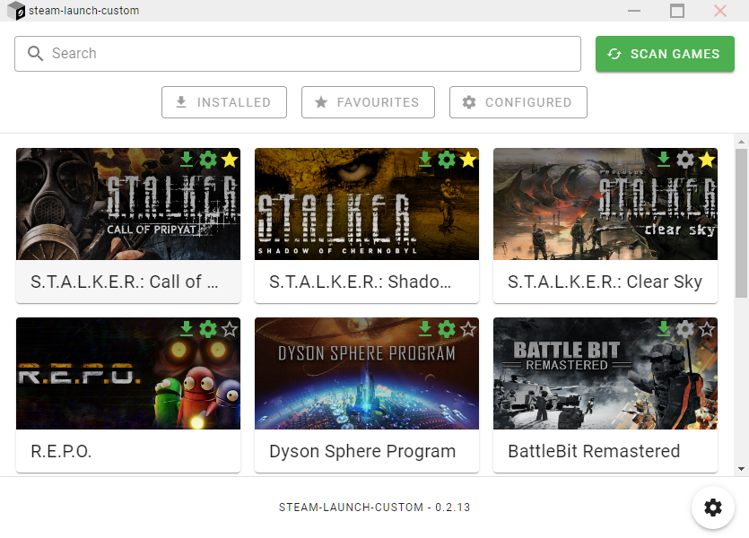
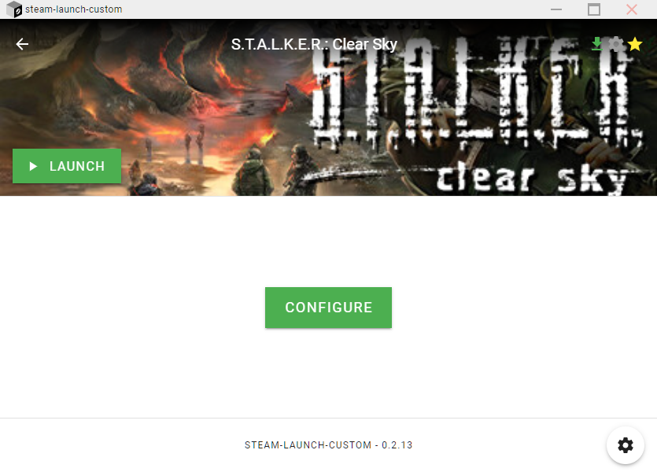
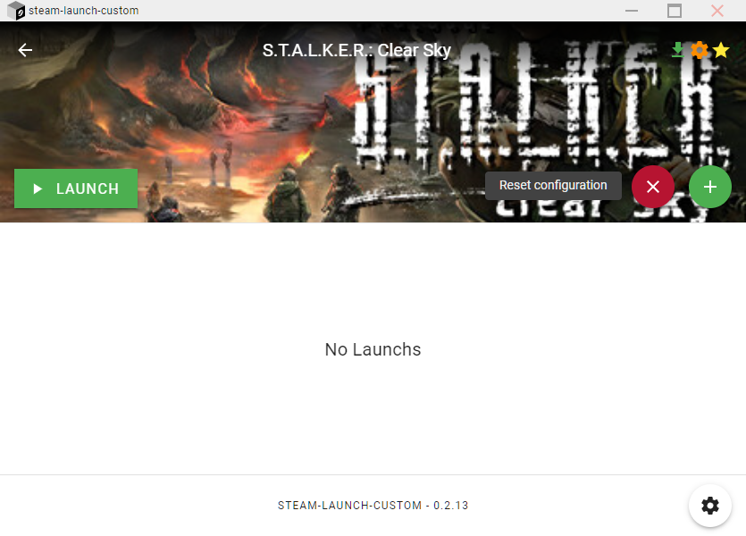
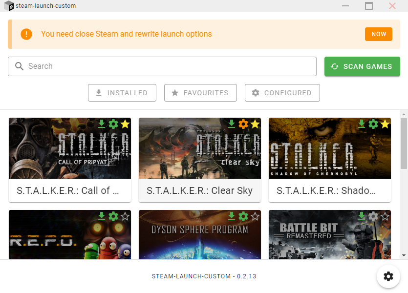
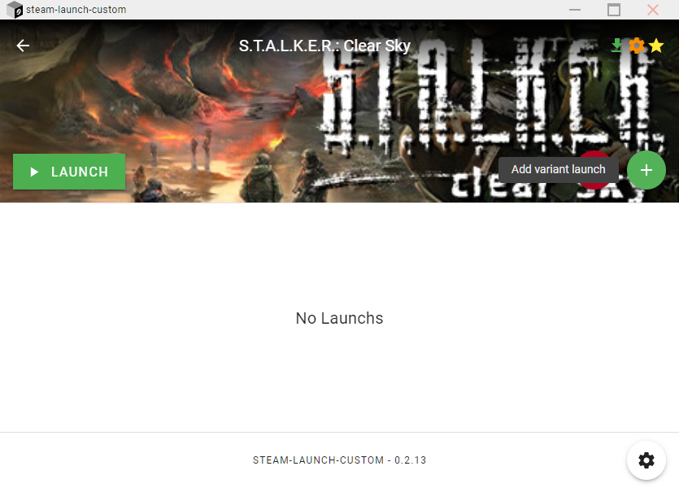
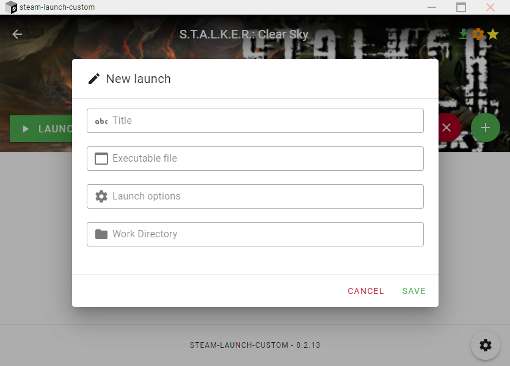
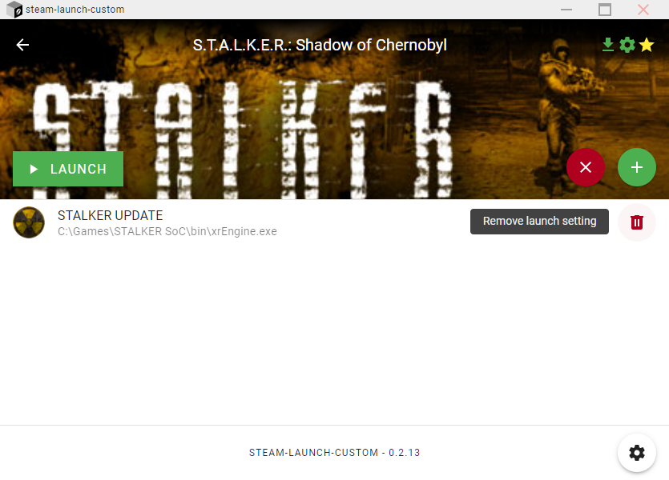
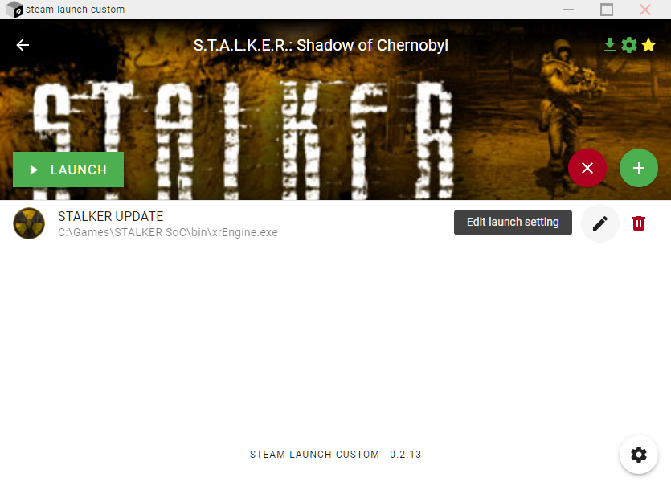
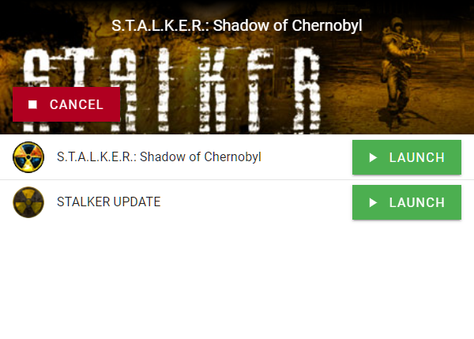

  

# Steam-Launcher-Custom

Add your own launch options for your steam games.

## Usage

1. Download [latest release](https://github.com/80LK/steam-launch-custom/releases/latest)
2. Open the app and wait for the games to be scanned
3. After scanning, you will see a window with all the installed games.
 

### Configuration
The configuration changes the Steam files to run **steam-launch-custom** to intercept the launch of the game and open a window with launch options.

1. Open the app and select a game
2. In the window that opens, click the "CONFIGURE" button

3. To reset the configuration, click on the round red button with a cross.

4. Changing the configuration status requires overwriting the Steam files and restarting it.  To do this, go back to the games page using the left arrow. You will see a notification saying "You need to close Steam and rewrite launch options". Click on the "NOW" button

### Add launchs
1. Open the app and select a game
2. To add a launch option, you need to [configure](#Configuration) the game.
3. Click on the round green button with a plus to add a new launch option.

4. In the window that opens, specify the name of the option, the executable file, the startup parameters, and the working directory, if necessary. Click on the "SAVE" button

5. To remove a launch option, click the trash icon next to the desired one.

6. To modify a launch option, click the pencil icon next to the desired one.

### Launching games
1. After [configuring](#Configuration) and [adding launch](#Add-launchs), you can launch the game in several ways.
    - Launch the game using Steam
    - Launch the game using **steam-launch-custom** select the game and click on the "LAUNCH" button. The game will still be launched via Steam, as the `steam//rungameid/{app_id}` request is being processed
2. To launch the game, click on the "LAUNCH" button next to the desired one. The first launch option is the original game that Steam is trying to launch.

3. To cancel the launch, click on the "CANCEL" button

## Links

